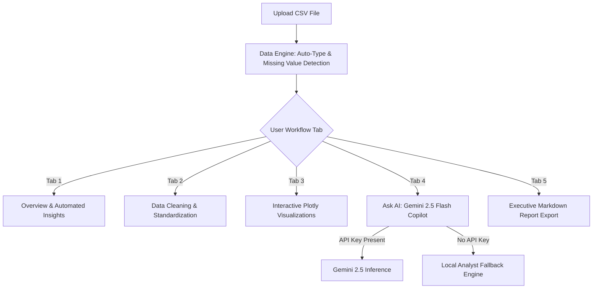

# 📊 Automated CSV Analyst — Smart Data Exploration & AI Insights

Upload any CSV dataset to clean data, explore interactive Plotly charts, and query an AI data copilot.

Automated CSV Analyst is an end-to-end data analysis tool built with Streamlit, Pandas, and Google Gemini 2.5 Flash. It lets you upload raw tabular data, perform automated statistical cleaning, build interactive charts, converse with an AI analyst, and export executive summary reports — all in your browser.

[](https://automated-csv-analyst.streamlit.app)

    

---

## ⚡ Key Highlights & Capabilities

- **Automated Statistical Audit**: Instantly detects dataset classification, column datatypes, missing values, skewness, outliers, correlation matrices, and time series trends.
- **Interactive Data Cleaning**: One-click whitespace trimming, missing value imputation, duplicate removal, type casting, and datetime parsing.
- **Dynamic Plotly Visualization Engine**: Automatically suggests and renders relevant bar charts, histograms, scatter plots, box plots, line charts, and correlation heatmaps with PNG export.
- **LLM-Powered Data Copilot**: Natural language Q&A backed by Google's `gemini-2.5-flash` model with intelligent context windowing for dataset summaries.
- **Offline / Local Fallback**: Includes a robust fallback mode allowing statistical exploration and chart generation without requiring an API key.

---

## 🛠️ Tech Stack & Architecture

| Layer | Technology | Function |
|---|---|---|
| **Frontend & UI** | [Streamlit](https://streamlit.io/) | Interactive multi-tab web dashboard & reactive state handling |
| **Data Engine** | [Pandas](https://pandas.pydata.org/), [NumPy](https://numpy.org/) | Data cleaning, type inference, outlier detection, & statistical aggregation |
| **Chart Engine** | [Plotly](https://plotly.com/python/), [Kaleido](https://github.com/plotly/kaleido) | Responsive interactive charts & high-resolution image rendering |
| **AI Copilot** | [Google Gemini 2.5 Flash](https://aistudio.google.com/) | Structured data reasoning, dynamic insights, & natural language Q&A |

---

## 🏗️ System Workflow & Pipeline



---

## 📁 Repository Structure

```tree
automated-csv-analyst/
├── final2.py          # Main Streamlit application source
├── requirements.txt   # Dependency manifest
└── README.md          # Project documentation
```

---

## 🚀 Quick Start & Installation

### 1. Clone & Setup
```bash
git clone https://github.com/tarun05-design/automated-csv-analyst.git
cd automated-csv-analyst

# Create virtual environment
python -m venv venv
venv\Scripts\activate      # Windows
source venv/bin/activate   # macOS/Linux
```

### 2. Install Requirements
```bash
pip install -r requirements.txt
```

### 3. (Optional) Configure Gemini API Key
You can pass your API key via the application sidebar or set up `.streamlit/secrets.toml`:
```toml
# .streamlit/secrets.toml
GEMINI_API_KEY = "your-gemini-api-key-here"
```

### 4. Launch Application
```bash
streamlit run final2.py
```
App opens at `http://localhost:8501`.

---

## ☁️ Streamlit Cloud Deployment Guide

1. Fork this repository.
2. Sign in to [share.streamlit.io](https://share.streamlit.io).
3. Connect your GitHub repository and set **Main file path** to `final2.py`.
4. Add `GEMINI_API_KEY` under **App Settings → Secrets**.
5. Click **Deploy**.

---

## 👤 Author & Connect

**Tarun P** — Machine Learning & Full Stack Developer
- 🌐 Portfolio: [tarun-portfolio.vercel.app](https://tarun-portfolio.vercel.app)
- 🐙 GitHub: [@tarun05-design](https://github.com/tarun05-design)
- 📧 Email: [tarunparthasarathy65@gmail.com](mailto:tarunparthasarathy65@gmail.com)
